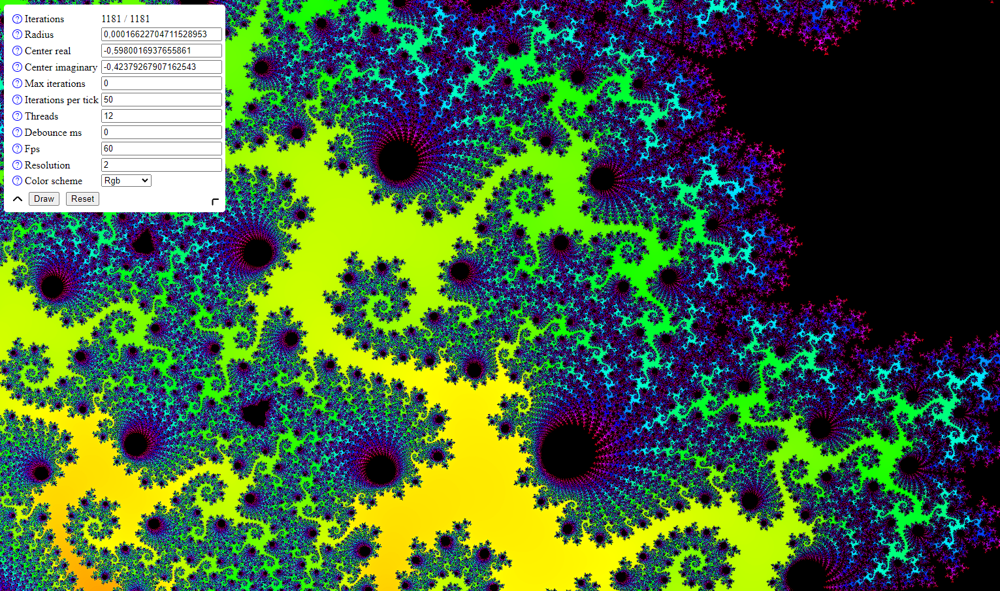

# One of the probably fastest Mandelbrot set renderers you can find on the Web.

Developed as a project the an excercise at my University, this program is a Mandelbrot set renderer built with Node.js and WebAssembly.

It uses the SIMD instructions and can optionally use Web Workers to render different parts of the image in parallel.

A working example can be found [here](https://hoppingadventure.com/mandelbrot/)



## Usage

### Installation

```bash
npm install
```

### Build WebAssembly

```bash
npm run build
```

### Run development server

```bash
npm run start
```

## Deployment

- copy [index.html](index.html) to your webserver
- copy [build folder](build) to your webserver (only the .js and .wasm files are needed)
- copy [src folder](src) to your webserver
- open index.html in your browser

## Further notice

This project is free to use and modify. If you have any questions, feel free to contact me.

## License

[Apache License 2.0](LICENSE)

If you use this project, I would appreciate credit by linking to this repository but I don't require it. I don't have any experience with licenses, so if you have any questions, feel free to contact me.
